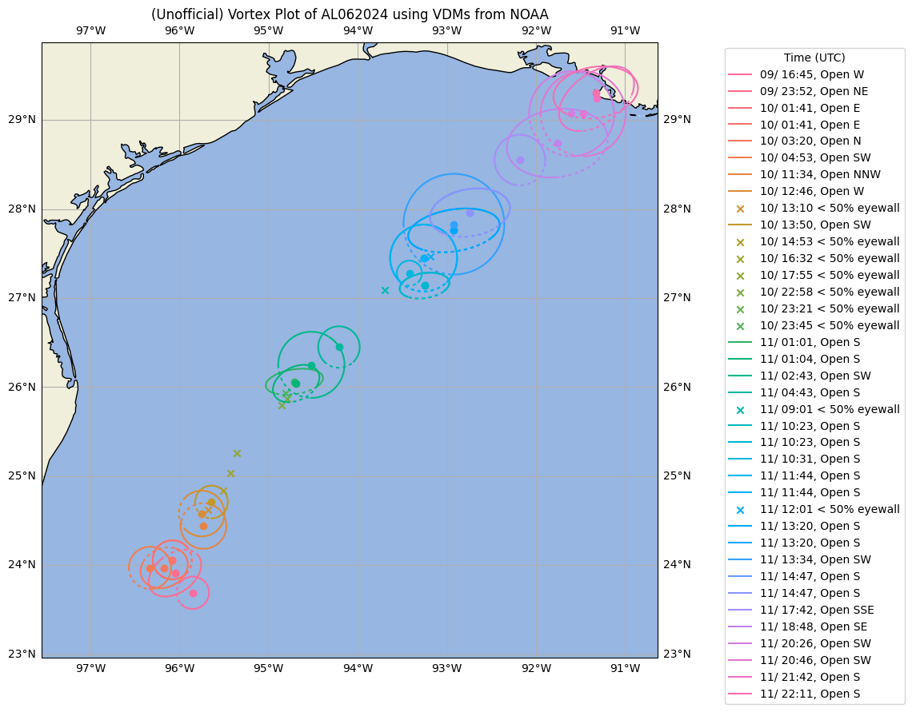

# nhc_recon
Tools for plotting recon data from NHC recon (hurricane hunter missions)

Unofficial and Experimental: Do not rely on this!

## nhc_vdm.py

Plots vortex data (mainly only shape, size, open characteristic) for a single hurricane (URLs or files)

Francine (2024) example (unofficial):

